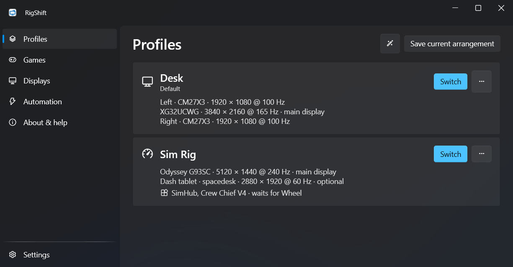
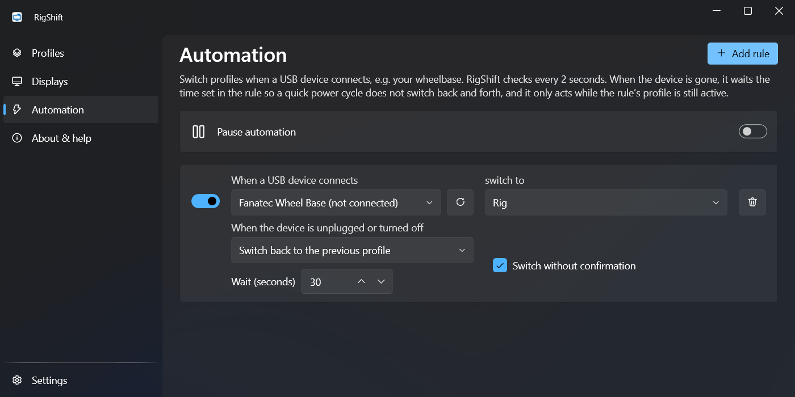
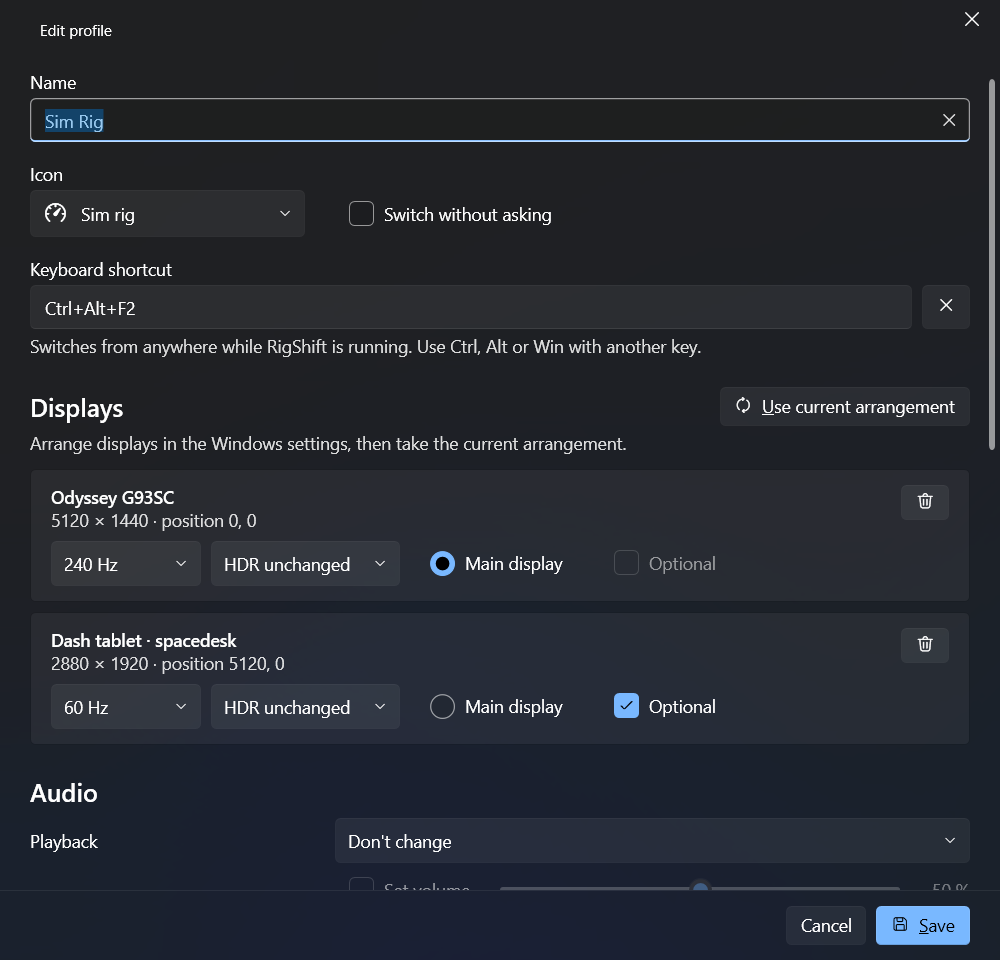
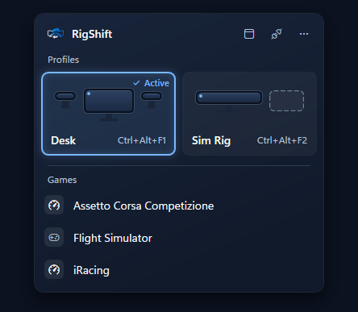
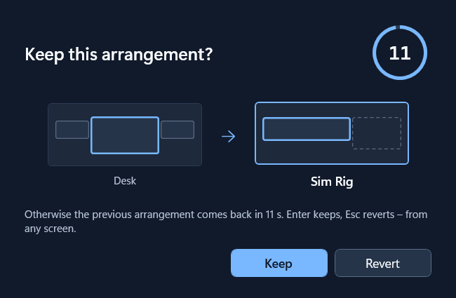
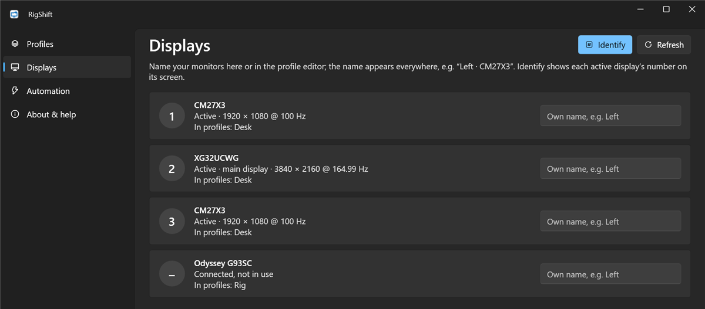
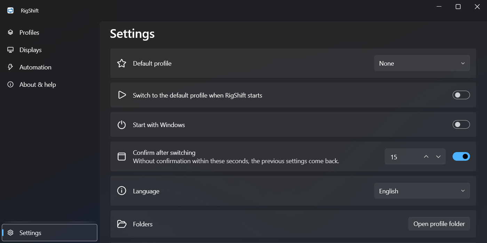
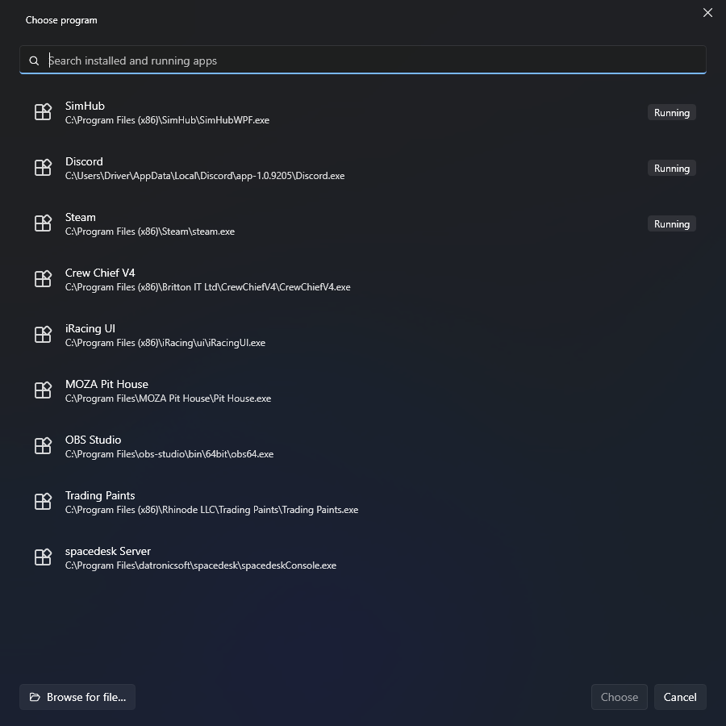

<h1>
  <picture>
    <source media="(prefers-color-scheme: dark)" srcset="docs/brand/rigshift-horizontal-color-dark-tagline.svg">
    
  </picture>
</h1>

[](https://github.com/ManuelStaggl/RigShift/actions/workflows/ci.yml)
[](LICENSE)

**Desk to sim rig in one step.** Turn on your wheelbase and RigShift switches your monitors, sound and apps over to
the rig. Turn it off and your desk is back. A small, free Windows tray app for sim racers who share one PC between a
desk and a cockpit – ultrawide, triple screens, TV or VR.

**[Download the latest version](https://github.com/ManuelStaggl/RigShift/releases/latest)** · Windows 10/11 · no
admin rights · [What's new](CHANGELOG.md)

<p align="center">
  <picture>
    <source media="(prefers-color-scheme: light)" srcset="docs/screenshots/profiles-light.png">
    
  </picture>
</p>

## Why RigShift?

Switching between desk and rig in Windows means opening the display settings, turning screens on and off, picking the
main display again, changing the sound output – and hoping nothing goes black. With several high-resolution or
high-refresh monitors it often does: Windows turns the screens on one by one, the graphics card runs out of outputs
halfway, and you end up with a dark screen or an error message.

RigShift hands Windows the whole target setup in one go, so it either works completely or nothing changes. And if you
see no picture after a switch, it simply switches back after a few seconds.

## What it does

**Switching**

- **One profile per setup** – which monitors are on, where they sit, which is the main display, resolution, refresh
  rate and HDR, plus playback and microphone device with volume.
- **Safety net:** keep the new layout or it reverts on its own.
- **Robust on real hardware:** wakes monitors from standby, asks you to switch on a monitor that is off and waits for
  it, recognizes monitors after reboots and cable swaps, and picks up optional screens (e.g. a spacedesk tablet) as
  soon as they appear.
- **Notices when Windows switches for you:** if Windows restores a profile's layout by itself – say, after you switch
  on a monitor – one click on the notification applies the profile's audio and apps too.
- **Tells you what's wrong** in plain words instead of an error code.

**Getting into the rig**

- **Wheelbase on = rig.** An automation rule switches when a USB device connects and back when it is gone – after a
  delay you choose, so a quick power cycle changes nothing. A rule can also wait for several devices, e.g. wheelbase
  and pedals, and you can give each device your own name. Devices are recognised by model (vendor and product id), so
  two identical devices look like one; pick a device that only the rig has.
- **Apps per profile:** start SimHub or Crew Chief, close what you don't need – optionally only once the wheelbase is
  detected. Pick them from a searchable list of installed and running programs.
- **Nothing gets lost:** windows left on a screen that is now off move to the main screen.
- **Race-ready:** keep the PC awake while you only use the wheel, keep game sound loud during Discord calls, and get a
  warning when Windows may cut power to your USB sim hardware.

**Control it your way**

- Tray icon, a keyboard shortcut per profile, Stream Deck or button box, `rigshift://` links and a command line.

## Screenshots

| | |
|---|---|
|  |  |
| **Automation** – to the rig when the wheelbase and pedals turn on, back to the desk when they are off, with your own device names. | **Profile editor** – displays with refresh rate, HDR and optional screens, keyboard shortcut, audio, apps. |
|  |  |
| **Tray popup** – switch profiles from the notification area. | **Safety net** – keep the new layout or it reverts on its own. |
|  |  |
| **Displays** – every connected monitor with the number Windows gives it, your own names, Identify. | **Settings** – default profile, autostart, confirmation time, language, automatic updates. |
|  | |
| **App picker** – installed and running programs with search; any other program as a file. | |

## Getting started

1. Download **`RigShift-win-Setup.exe`** from the [latest release](https://github.com/ManuelStaggl/RigShift/releases/latest)
   and run it. RigShift installs for your user account and starts in the tray. A portable ZIP is attached as well.
2. Arrange your desk in the Windows display settings, then click **Save current arrangement** in RigShift.
3. Do the same for your rig.
4. Optional: on **Automation**, add a rule for your wheelbase.

RigShift is a free hobby project and not code-signed, so Windows SmartScreen may say *"Windows protected your PC"*.
Click **More info → Run anyway**.

Updates install themselves the next time RigShift starts; you can turn that off in **Settings**. Profiles, settings
and logs live in `%AppData%\RigShift` and are kept when you uninstall; uninstalling removes the autostart entry and
the `rigshift://` link handler.

## Stream Deck and button boxes

No plugin needed:

- **Hotkey:** give the profile a keyboard shortcut and use the Stream Deck *Hotkey* action or a button box key.
  Fastest option.
- **Link:** a Stream Deck *Website* action with `rigshift://apply/Rig`. A link always asks for confirmation,
  even when "Confirm after switching" is off or the profile's timeout is 0, because any web page can open one.
- **Shortcut:** **⋯ → Create desktop shortcut** on a profile and point a Stream Deck *Open* action at it.

## Command line

```bat
RigShift.exe apply <name> [--no-confirm] [--dry-run]
RigShift.exe list
RigShift.exe save <name>
RigShift.exe status
```

Names are not case-sensitive. `save` stores the current display arrangement and default playback device; an existing
profile with that name is updated. `apply` and `save` start RigShift in the tray if needed and wait for the result.

| Exit code | Meaning |
|---|---|
| 0 | Applied (optional displays may be missing), or command succeeded |
| 1 | Failed, or another switch is running |
| 2 | Blocked: a required display is missing, nothing changed |
| 3 | Not confirmed, previous arrangement restored |
| 4 | Profile not found |
| 5 | Invalid arguments |

RigShift.exe is a Windows GUI program, so shells do not wait for it. To see output and exit code, run
`start /wait RigShift.exe status` (cmd) or `Start-Process RigShift.exe status -Wait -NoNewWindow` (PowerShell).

## Requirements

- Windows 10 (2004+) or Windows 11, x64
- Any graphics card. Tested on NVIDIA; feedback from AMD and Intel users is welcome.

## Help and feedback

A monitor is reported as missing although it is only asleep? See [Monitors in standby](docs/monitor-standby.md) – it
also explains why HDR is worth trying in Windows first. Pedals or a wheelbase dropping out: see
[USB power saving](docs/usb-power-saving.md).

Something not working? Use **About & help → Copy diagnostic info** and open an
[issue](https://github.com/ManuelStaggl/RigShift/issues/new) – the log from `%AppData%\RigShift\logs` helps too. The
diagnostic info contains display models and shortened device ids but no audio device IDs, and your user name is replaced; the log files
are not anonymized (paths with your user name, audio device IDs), so look through them before attaching one. Ideas and pull requests are welcome, see
[CONTRIBUTING.md](CONTRIBUTING.md) and the [roadmap](docs/ROADMAP.md). RigShift is meant to stay small.

## For developers

```bash
dotnet build RigShift.slnx
dotnet test --solution RigShift.slnx
```

Requires the .NET 10 SDK (see `global.json`). How switching works and why:
[architecture](docs/ARCHITECTURE.md) and [display topology rules](docs/display-topology.md).

| Path | Content |
|---|---|
| `src/RigShift.Core` | Profiles, topology planner, switch orchestration – no Win32 |
| `src/RigShift.Windows` | CCD API, Core Audio, USB devices (CsWin32) |
| `src/RigShift.App` | WPF tray app, CLI |
| `tests/` | Unit tests (xunit v3) |

## Support

RigShift is free and stays free. If it saves you time on the way into the rig and you'd like to say thanks, you can
[buy me a coffee on Ko-fi](https://ko-fi.com/filthyjoker) – entirely optional.

## License

Code: [MIT](LICENSE) © 2026 Manuel Staggl.
The RigShift logo, symbol and app icons are excluded from the MIT license – see [brand assets](docs/brand/README.md)
for what you may do with them. Forks are welcome, with their own logo.
