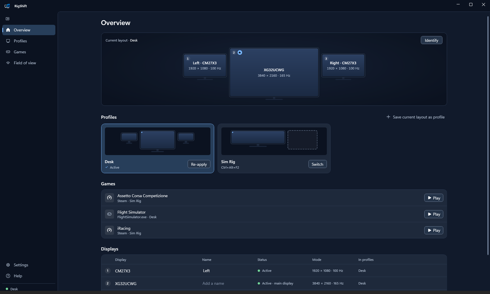

<h1>
  <picture>
    <source media="(prefers-color-scheme: dark)" srcset="docs/brand/rigshift-horizontal-color-dark-tagline.svg">
    
  </picture>
</h1>

[](https://github.com/ManuelStaggl/RigShift/actions/workflows/ci.yml)
[](https://github.com/ManuelStaggl/RigShift/releases/latest)
[](LICENSE)

RigShift switches one Windows PC between your desk and your sim rig: displays, audio and apps in one step.
Turn the wheelbase on and the PC goes to rig mode, turn it off and your desk is back. If a switch leaves you
without a picture, RigShift reverts it on its own.

**[Download for Windows 10/11](https://github.com/ManuelStaggl/RigShift/releases/latest/download/RigShift-win-Setup.exe)**
· free and open source (MIT) · no account, no telemetry, no admin rights · [Is it safe?](#is-it-safe)

<p align="center">
  
</p>

## Already using DisplayMagician, DisplayFusion or a batch file?

Keep it if it works for you. RigShift is for you if you want

- the switch to happen when the wheelbase powers on, and back when it is off,
- a layout that reverts by itself when a screen stays black,
- audio and microphone, SimHub and Crew Chief, and your desktop icons in the same profile – and with a game entry,
  the tools' window positions too.

DisplayMagician is the better pick for AMD Eyefinity and many game launchers, DisplayFusion for full window
management. [Detailed comparison](docs/compare.md) · [FAQ](docs/faq.md)

## Features

- **Profiles** – which monitors are on, layout, main display, resolution, refresh rate, HDR, NVIDIA Surround, audio and volume.
- **Triggers** – wheelbase on/off, hotkey, desktop shortcut, Stream Deck, `rigshift://` link, command line.
- **Games** – one click: switch, start SimHub and Crew Chief, place their windows, launch the sim from Steam or Epic, clean up after.
- **Safety net** – the whole layout is applied in one step; no picture means it reverts after a countdown, even after a crash.
- **Real hardware** – wakes sleeping monitors, waits for a slow G9, skips optional screens like a spacedesk tablet.
- **Desktop icons** – each profile keeps its own icon layout and puts it back after the switch.
- **Field of view** – the right FOV value for 18 sims, from your monitor's real size.
- **Backup** – profiles, games and settings as one ZIP. English and German.

| | |
|---|---|
|  |  |
| **Profiles** – displays, audio, apps and behavior per profile. | **Triggers** – to the rig when wheelbase and pedals are on, back when they are off. |
|  |  |
| **Games** – one click for the sim, its profile, its tools and the way back. | **Tools** – start order, waiting for the wheelbase, before or after the game. |
|  |  |
| **Tray** – switch or start a sim from the notification area. | **Safety net** – keep the new layout with any wheel button, or it reverts. |

<p align="center">
  <br>
  <b>Field of view</b> – the rig from above and the right number for every sim.
</p>

## Getting started

1. [Download the setup](https://github.com/ManuelStaggl/RigShift/releases/latest/download/RigShift-win-Setup.exe) and
   run it. RigShift installs for your Windows user and starts in the tray. A portable ZIP is in the
   [release](https://github.com/ManuelStaggl/RigShift/releases/latest) too.
2. The setup assistant saves your desk, then your rig after you rearrange the displays, and can add a wheelbase rule.
3. Later, arrange displays in the Windows settings and pick **New → From the current layout**, or edit any profile.

Updates install on the next start (Settings). Data lives in `%AppData%\RigShift`.

## Tested on

| Setup | Result |
|---|---|
| Windows 11 · RTX 4080 SUPER · desk: XG32UCWG + 2× CM27X3 · rig: Odyssey G9 (G93SC) + spacedesk display | my own PC, daily use since September 2026 |
| Windows 10 code base (Server 2022, build 20348) | every change in CI: tests and a live read of the display configuration |
| NVIDIA Surround on/off | not tested on a Surround rig yet – reports welcome |
| AMD / Intel graphics | not tested yet – [report your setup](https://github.com/ManuelStaggl/RigShift/issues/new?template=hardware_report.yml) |

Every hardware report ends up in this table.

## Is it safe?

RigShift is a free hobby project and not code-signed, so Windows shows **"Windows protected your PC"** the first
time. Click **More info → Run anyway**.

You don't have to take my word for it:

- **Source:** everything is in this repository, MIT licensed. No telemetry, see [privacy](PRIVACY.md).
- **VirusTotal:** each release links its scan.
- **Built from this source:** every release carries a GitHub build attestation –
  `gh attestation verify RigShift-win-Setup.exe -R ManuelStaggl/RigShift`
- **Checksums and SBOM:** `SHA256SUMS` and a CycloneDX SBOM in every release.

**Smart App Control** (Windows 11) blocks unsigned apps without a "run anyway" option; RigShift can't run while it is
on. Why 80 MB? RigShift brings its own .NET runtime, so there is nothing to install first. Updates after that are
usually a few MB. More in the [FAQ](docs/faq.md) and [SECURITY.md](SECURITY.md).

## How RigShift is built

I write RigShift with Claude Code (Anthropic) as a pair programmer, and I use it on my own rig every day. What keeps it
honest is not the tool but the checks: 1,200+ automated tests, analyzers with warnings as errors and CodeQL run on
every change; each release is installed over the previous version, started and checked in CI before it is published,
and carries checksums, an SBOM and a build attestation. Hardware I don't own is listed as untested above, not
claimed.

## Stream Deck and button boxes

- **Hotkey action:** give the profile or the game a keyboard shortcut under **Triggers**. **Settings → Switch back**
  gives you one key for both directions.
- **Website action:** `rigshift://apply/Rig`, `rigshift://toggle` or `rigshift://play/iRacing`. Links always ask for
  confirmation.
- **Open action:** **Triggers → Create on the desktop**, or **⋯ → Create shortcut** on a profile or a game. A game's
  shortcut carries the game's name and its icon.

## Command line

```bat
RigShift.exe apply <name> [--no-confirm] [--dry-run]
RigShift.exe toggle [--no-confirm] [--dry-run]
RigShift.exe save <name>
RigShift.exe list
RigShift.exe status
RigShift.exe games
RigShift.exe play <name>
RigShift.exe icons <name>
```

`icons` puts the desktop icons back where the profile saved them, without switching.

Exit codes: 0 applied, 1 failed, 2 blocked (required display missing), 3 not confirmed and reverted, 4 profile or game
not found, 5 invalid arguments. RigShift.exe is a GUI program; use `start /wait` (cmd) or `Start-Process -Wait -NoNewWindow`
(PowerShell) to see its output.

## Help

- Questions and "does it work with my setup?": [Discussions](https://github.com/ManuelStaggl/RigShift/discussions).
- A monitor counts as missing while it sleeps: [monitors in standby](docs/monitor-standby.md).
- Wheelbase or pedals drop off USB: [USB power saving](docs/usb-power-saving.md).
- Something else: **Help → Save support package** and attach the ZIP to the [issue](https://github.com/ManuelStaggl/RigShift/issues/new?template=bug_report.yml) that opens.

Ideas and pull requests are welcome, see [CONTRIBUTING.md](CONTRIBUTING.md) and the [roadmap](docs/ROADMAP.md).
If RigShift saves you time, you can [buy me a coffee](https://ko-fi.com/filthyjoker).

## Development

```bash
dotnet build RigShift.slnx
dotnet test --solution RigShift.slnx
```

.NET 10 SDK. `RigShift.Core` holds profiles, planner and orchestration without Win32; `RigShift.Windows` the CCD,
Core Audio and USB layer (CsWin32); `RigShift.App` the WPF tray app and CLI. See [ARCHITECTURE.md](docs/ARCHITECTURE.md)
and the [display topology rules](docs/display-topology.md).

## License

[MIT](LICENSE) © 2026 Manuel Staggl. The RigShift logo and icons are not covered by the MIT license, see
[brand assets](docs/brand/README.md). Bundled components: [third-party notices](THIRD-PARTY-NOTICES.md).

Silent install, uninstall and offline use: [deployment](docs/deployment.md).
