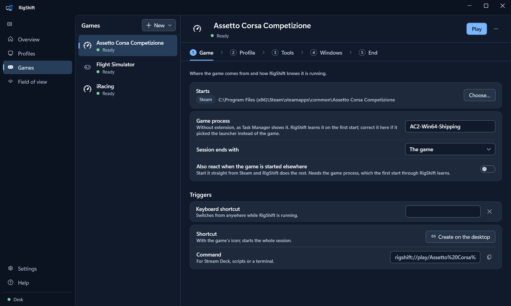
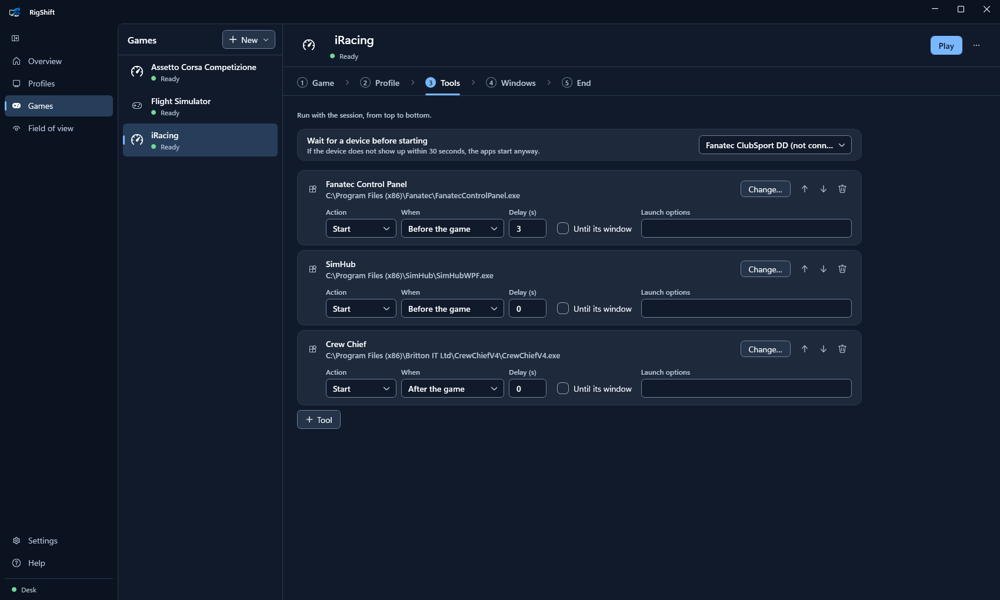
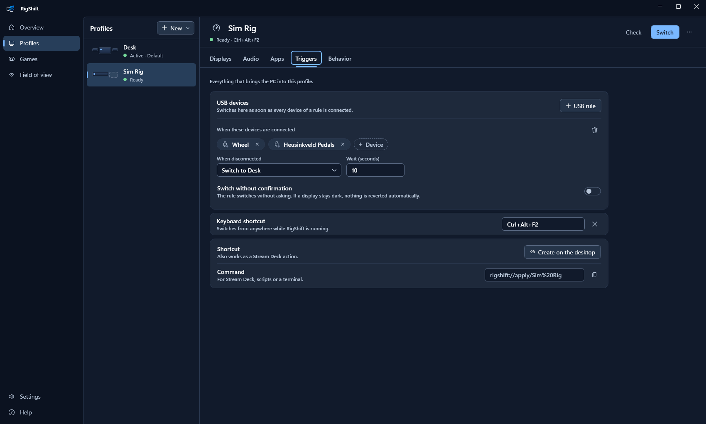
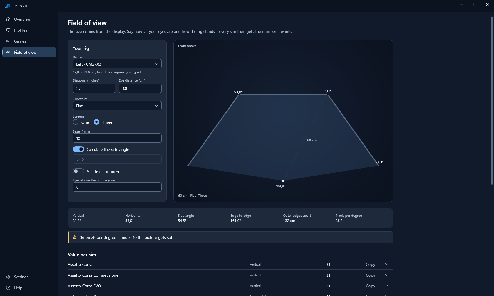

<h1>
  <picture>
    <source media="(prefers-color-scheme: dark)" srcset="docs/brand/rigshift-horizontal-color-dark-tagline.svg">
    
  </picture>
</h1>

[](https://github.com/ManuelStaggl/RigShift/actions/workflows/ci.yml)
[](https://github.com/ManuelStaggl/RigShift/releases/latest)
[](LICENSE)

RigShift switches a Windows PC between your desk and your sim rig: display layout, sound and apps in one step, by
hotkey, from the tray, or automatically when the wheelbase turns on. Or it does the whole evening for you – one click
starts the sim with the right screens, its tools and their windows, and puts everything back when you quit.

**[Download](https://github.com/ManuelStaggl/RigShift/releases/latest)** · Windows 10/11 · free, no admin rights ·
[Changelog](CHANGELOG.md)

<p align="center">
  
</p>

## Features

- **Profiles.** Each profile stores which monitors are on, their layout, main display, resolution, refresh rate and
  HDR, plus playback and microphone device with volume.
- **Triggers.** Every profile carries its own way in: a hotkey, a desktop shortcut, and a USB rule that switches to the
  rig when your wheelbase connects and back when it is gone, after a delay you choose.
- **Games.** A game entry brackets a whole session: switch to its profile, start SimHub and Crew Chief, put their
  windows back where they belong, launch the sim from Steam or Epic, and clean up when it ends. Start it from the tray,
  a hotkey or its own desktop shortcut – or let RigShift notice when you start the game from Steam yourself.
  **Find installed games** picks your sims off the list of what Steam and Epic have on this PC, on any drive, with no
  sign-in and nothing to type.
- **Apps.** Start SimHub, Crew Chief or anything else with a profile and close what you do not need. The next one can
  wait until the previous one shows its window, instead of a guessed delay.
- **Desktop icons.** Windows keeps one icon layout for all arrangements and reshuffles it whenever your screens change.
  A profile can carry its own, and puts it back after the switch.
- **One atomic switch.** Windows gets the whole layout at once, so the switch either works or nothing changes. No
  picture afterwards? It reverts on its own; Enter or any wheel, button box or controller button keeps it. A screen
  that stays dark anyway: **Ctrl+Alt+Shift+D** turns every display on.
- **Made for real hardware.** Wakes sleeping monitors, waits for one that is off, tolerates optional screens such as a
  spacedesk tablet, and moves windows off screens that are now dark.
- **Field of view.** Your monitors report their size, so the page only asks for the curve, how far away you sit and
  how the rig stands. Eighteen sims get the number they really want – degrees, a multiplier, a slider or radians –
  with the triple-screen fields each one asks for, and a top view that follows every change.
- **Control it your way.** Tray, hotkeys, Stream Deck, `rigshift://` links, command line. Backup and restore as a ZIP.

| | |
|---|---|
|  |  |
| **Games** – one click for the sim, its profile, its tools and the way back. | **Five steps** – launcher, profile, tools with their order, window positions and what happens when you quit. |
|  |  |
| **Triggers** – to the rig when wheelbase and pedals are on, back when they are off. | **Settings** – default profile, countdown, language, updates, and a name for every device. |
|  |  |
| **Tray** – switch or start a sim from the notification area. | **Safety net** – keep the new layout or it reverts after a countdown. |

<p align="center">
  <br>
  <b>Field of view</b> – the rig from above and the right number for every sim.
</p>

## Getting started

1. Download `RigShift-win-Setup.exe` from the [latest release](https://github.com/ManuelStaggl/RigShift/releases/latest)
   and run it (a portable ZIP is attached too). RigShift installs per user and starts in the tray.
2. The setup assistant saves your desk, then your rig after you rearrange the displays, and can add a wheelbase rule.
3. Later, arrange displays in the Windows settings and pick **New → From the current layout**, or edit any profile.

RigShift is not code-signed, so SmartScreen may warn on first start: **More info → Run anyway**. Updates install on
the next start (Settings). Data lives in `%AppData%\RigShift`.

## Stream Deck and button boxes

- **Hotkey action:** give the profile or the game a keyboard shortcut under **Triggers**. **Settings → Previous
  profile** gives you one key for both directions.
- **Website action:** `rigshift://apply/Rig`, `rigshift://toggle` or `rigshift://play/iRacing`. Links always ask for
  confirmation.
- **Open action:** **Triggers → Create on the desktop**, or **⋯ → Create shortcut** on a profile or a game. A game's
  shortcut carries the game's name and its icon.

## Command line

```bat
RigShift.exe apply <name> [--no-confirm] [--dry-run]
RigShift.exe toggle [--no-confirm] [--dry-run]
RigShift.exe save <name>
RigShift.exe list
RigShift.exe status
RigShift.exe games
RigShift.exe play <name>
RigShift.exe icons <name>
```

`icons` puts the desktop icons back where the profile saved them, without switching.

Exit codes: 0 applied, 1 failed, 2 blocked (required display missing), 3 not confirmed and reverted, 4 profile or game
not found, 5 invalid arguments. RigShift.exe is a GUI program; use `start /wait` (cmd) or `Start-Process -Wait -NoNewWindow`
(PowerShell) to see its output.

## Requirements

Windows 10 (2004+) or Windows 11, x64. Any graphics card; tested on NVIDIA, reports from AMD and Intel users are
welcome.

## Help

- A monitor counts as missing while it sleeps: [Monitors in standby](docs/monitor-standby.md).
- Wheelbase or pedals drop off USB: [USB power saving](docs/usb-power-saving.md).
- Something else: **Help → Save support package** and attach the ZIP to the [issue](https://github.com/ManuelStaggl/RigShift/issues/new?template=bug_report.yml) that opens.

Ideas and pull requests are welcome, see [CONTRIBUTING.md](CONTRIBUTING.md) and the [roadmap](docs/ROADMAP.md).
If RigShift saves you time, you can [buy me a coffee](https://ko-fi.com/filthyjoker).

## Development

```bash
dotnet build RigShift.slnx
dotnet test --solution RigShift.slnx
```

.NET 10 SDK. `RigShift.Core` holds profiles, planner and orchestration without Win32; `RigShift.Windows` the CCD,
Core Audio and USB layer (CsWin32); `RigShift.App` the WPF tray app and CLI. See [ARCHITECTURE.md](docs/ARCHITECTURE.md)
and the [display topology rules](docs/display-topology.md).

## License

[MIT](LICENSE) © 2026 Manuel Staggl. The RigShift logo and icons are not covered by the MIT license, see
[brand assets](docs/brand/README.md). Bundled components: [third-party notices](THIRD-PARTY-NOTICES.md).

No telemetry – see [privacy](PRIVACY.md). Silent install, uninstall and offline use: [deployment](docs/deployment.md).
