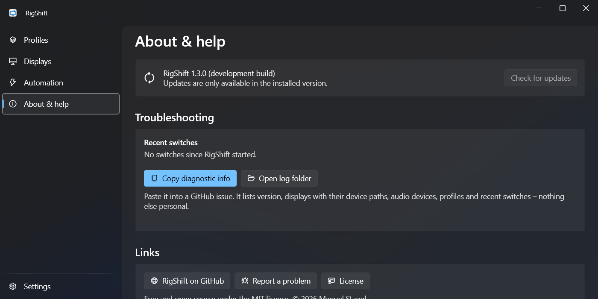

<h1>
  <picture>
    <source media="(prefers-color-scheme: dark)" srcset="docs/brand/rigshift-horizontal-color-dark-tagline.svg">
    
  </picture>
</h1>

[](https://github.com/ManuelStaggl/RigShift/actions/workflows/ci.yml)
[](LICENSE)

**One click between desk and sim rig.** RigShift is a small Windows tray app that switches your complete
display topology *and* audio devices atomically – built for sim racers who share one PC between a multi-monitor
desk and an ultrawide / triple-screen / VR cockpit.

> Status: **1.3** – tested on a real desk ↔ sim rig setup. [Download](https://github.com/ManuelStaggl/RigShift/releases/latest)
> · [Roadmap](docs/ROADMAP.md)

<p align="center">
  <picture>
    <source media="(prefers-color-scheme: light)" srcset="docs/screenshots/profiles-light.png">
    
  </picture>
</p>

## Why another display switcher?

Because the existing ones fail on modern GPUs. NVIDIA cards have a fixed budget of display heads, and
high-bandwidth displays (4K@165 Hz, 5120×1440@240 Hz) consume two each. Tools that enable and disable monitors
one at a time run out of heads mid-sequence and error out. RigShift hands the *entire* target topology to
Windows in a single `SetDisplayConfig` call – the only approach that works on that hardware.

Beyond that, RigShift is designed to be boring in the good way:

- **Stable display identity** via device paths and EDID, so profiles survive reboots, driver updates and
  reconnects (including virtual displays such as spacedesk).
- **Waits instead of failing** when a monitor is still waking up over HDMI or a wireless display is not connected
  yet; optional displays are picked up as soon as they appear.
- **Safety net:** if you don't confirm the new layout within a few seconds (because there is no picture),
  RigShift rolls back to the previous one.
- **Audio included:** playback, recording and communications devices plus volume per profile.
- **Explains problems** ("this combination exceeds your GPU's display heads") instead of showing error 31.
- **Keyboard shortcut per profile**, e.g. Ctrl+Alt+F1, works from anywhere while RigShift runs.
- **Scriptable:** `RigShift.exe apply Rig` or a `rigshift://apply/Rig` link from a Stream Deck, button box, SimHub
  or shortcut.

Made for getting into the rig:

- **Turn on the wheelbase, RigShift does the rest.** An automation rule switches to your rig profile when a USB
  device connects and back when it is gone – after a delay you choose, so a quick power cycle changes nothing.
- **Apps per profile:** start SimHub or Crew Chief and close what you don't need once the switch is confirmed –
  optionally only after the wheelbase has been detected.
- **Nothing gets lost:** windows left on a screen that is now off move to the main screen.
- **HDR and refresh rate per display**, and your own names for monitors ("Left · CM27X3") everywhere.
- **Race-ready:** keep the PC awake while you drive with only a wheel, keep game sound loud during Discord calls, and
  get a warning when Windows may power down your USB sim hardware.

## Screenshots

| | |
|---|---|
|  |  |
| **Tray popup** – switch profiles from the notification area. | **Safety net** – keep the new layout or it reverts on its own. |
|  |  |
| **Profile editor** – displays with refresh rate and HDR, audio with volume, apps to start or stop. | **Settings** – default profile, autostart, confirmation time, language. |
|  | |
| **Automation** – switch to the rig when the wheelbase turns on, and back when it is off. | |
|  |  |
| **Displays** – every connected monitor, your own names, Identify. | **About & help** – version, updates, recent switches, diagnostic info. |

## Installation

Download **`RigShift-win-Setup.exe`** from the [latest release](https://github.com/ManuelStaggl/RigShift/releases/latest)
and run it. RigShift installs for your user account (no admin rights), adds a Start menu entry and starts in the tray.
A portable ZIP is attached to every release as well.

RigShift is not code-signed yet, so Windows SmartScreen may say *"Windows protected your PC"*. Click
**More info → Run anyway**. Signing is planned (see roadmap).

**Updates** install themselves: RigShift checks GitHub at startup and once a day, downloads a new version in the
background and installs it the next time it starts. **About & help** shows the version and what is new and lets you
check for updates or install one right away; in **Settings** you can turn automatic installation off so RigShift only
reports new versions.

Profiles, settings and logs are stored in `%AppData%\RigShift` and are kept when you uninstall.

## Planned features

See [docs/ROADMAP.md](docs/ROADMAP.md). RigShift is meant to stay small. Next up: a setup wizard for the first two
profiles, code signing and winget, and validation on AMD and Intel graphics.

## Command line

```bat
RigShift.exe apply <name> [--no-confirm] [--dry-run]
RigShift.exe list
RigShift.exe save <name>
RigShift.exe status
```

Names are not case-sensitive. `save` stores the current display arrangement and default playback device; an
existing profile with that name is updated. `apply` and `save` start RigShift in the tray if it is not running and
wait for the result; the easiest way to get a ready-made shortcut (also for a Stream Deck "Open" action) is
**⋯ → Create desktop shortcut** on a profile.

The installed version also handles links: `rigshift://apply/Sim%20Rig` switches like `apply` (always with
confirmation), e.g. from a browser bookmark, Win+R or a Stream Deck "Website" action.

| Exit code | Meaning |
|---|---|
| 0 | Applied (optional displays may be missing), or command succeeded |
| 1 | Failed, or another switch is running |
| 2 | Blocked: a required display is missing, nothing changed |
| 3 | Not confirmed, previous arrangement restored |
| 4 | Profile not found |
| 5 | Invalid arguments |

RigShift.exe is a Windows GUI program, so shells do not wait for it. To see output and exit code in a console,
run `start /wait RigShift.exe status` (cmd) or `Start-Process RigShift.exe status -Wait -NoNewWindow`
(PowerShell).

## Stream Deck and button boxes

No plugin needed:

- **Hotkey:** give the profile a keyboard shortcut in the profile editor and use the Stream Deck *Hotkey* action (or map
  it to a button box key). Fastest option.
- **Link:** a Stream Deck *Website* action with `rigshift://apply/Rig` (installed version; always asks for confirmation).
- **Shortcut:** **⋯ → Create desktop shortcut** on a profile and point a Stream Deck *Open* action at it.

## Requirements

- Windows 10 (2004+) or Windows 11, x64
- Any GPU – the Windows CCD API is vendor-neutral. Head-limit heuristics are tuned for NVIDIA first;
  AMD/Intel feedback is welcome.
- No admin rights needed.

## Building

```bash
dotnet build RigShift.slnx
dotnet test --solution RigShift.slnx
```

Requires the .NET 10 SDK (see `global.json`). Windows is needed to build the app; the core library and its
tests build anywhere.

## Project layout

| Path | Content |
|---|---|
| `src/RigShift.Core` | Domain logic: profiles, topology planner, switch orchestration – no Win32 |
| `src/RigShift.Windows` | CCD API, Core Audio, `IPolicyConfig`, device notifications (CsWin32) |
| `src/RigShift.App` | WPF tray app (WPF-UI), DI host, CLI |
| `tests/` | Unit tests (xunit v3) |
| `docs/` | [Architecture](docs/ARCHITECTURE.md), [display topology rules](docs/display-topology.md), [decisions](docs/decisions/), roadmap |
| `legacy/` | The PowerShell script RigShift replaces – proven reference implementation |

## Related projects

- [DisplayProfileManager](https://github.com/zac15987/DisplayProfileManager) – WPF, .NET Framework 4.8, staged (non-atomic) application, on hold
- [MonitorSwitcher](https://github.com/fernandoenzo/MonitorSwitcher) – tray tool for exclusive monitor switching
- [DisplayMagician](https://github.com/terrymacdonald/DisplayMagician) – game-launcher-centric, NVIDIA/AMD APIs

RigShift focuses on the atomic switch, robustness on real hardware and sim-racing workflows.

## Contributing

Issues and pull requests are welcome – see [CONTRIBUTING.md](CONTRIBUTING.md). For bug reports, use
**About & help → Copy diagnostic info** and attach the log from `%AppData%\RigShift\logs` (both contain display device
paths, nothing else personal).

## License

Code: [MIT](LICENSE) © 2026 Manuel Staggl.
The RigShift logo, symbol and app icons are excluded from the MIT license – see [brand assets](docs/brand/README.md)
for what you may do with them. Forks are welcome, with their own logo.
